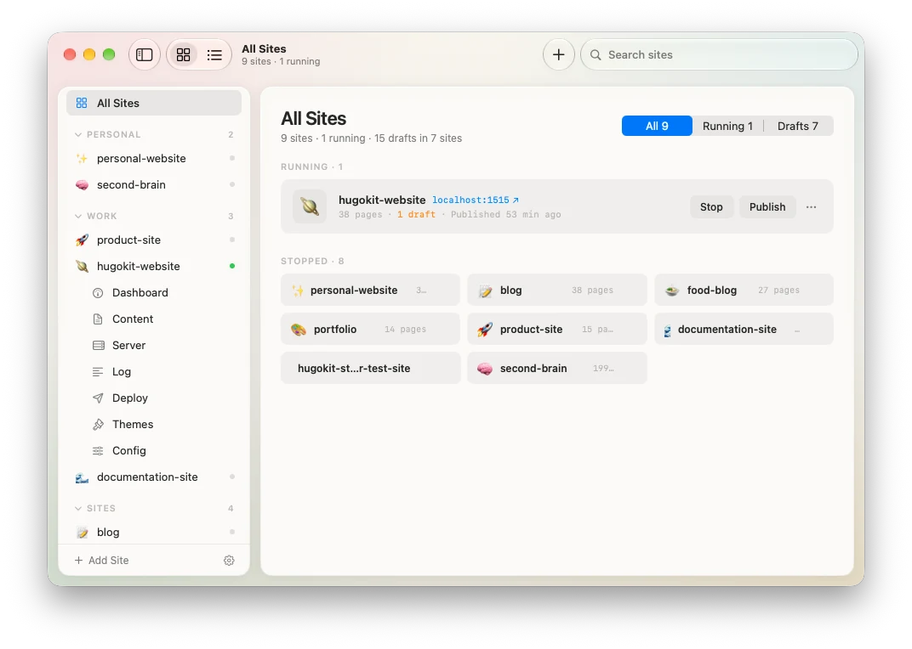
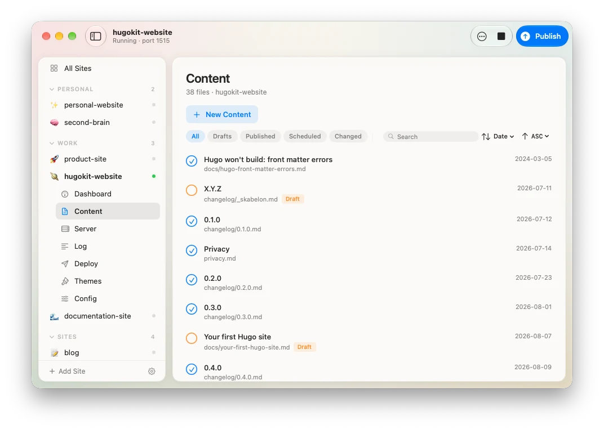
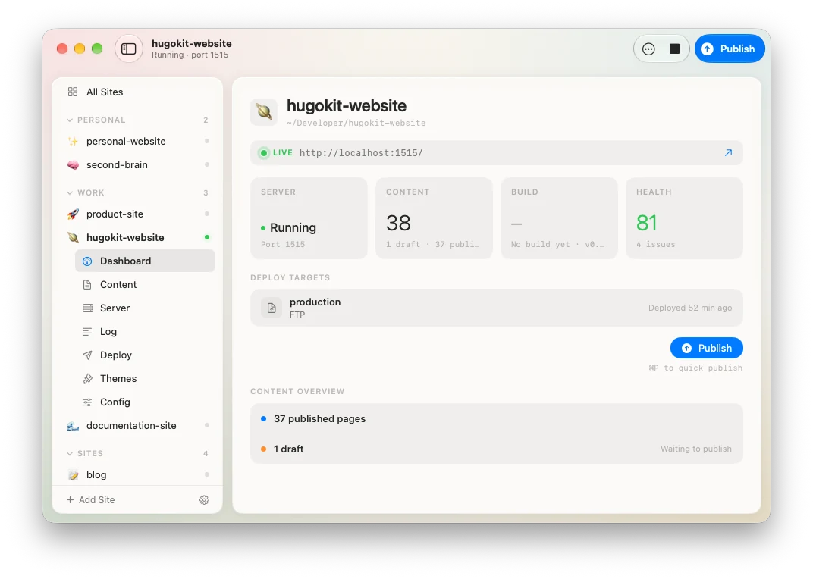

  <picture>
    <source media="(prefers-color-scheme: dark)" srcset="docs/mark-dark.png">
    
  </picture>

# HugoKit

A Mac app for [Hugo](https://gohugo.io). Run the server, preview your pages and publish your site from one window.

[Download](https://github.com/andersmortensen/hugokit/releases/latest) · [hugokit.com](https://hugokit.com) · [Report a bug](https://github.com/andersmortensen/hugokit/issues)

<picture>
  <source media="(prefers-color-scheme: dark)" srcset="docs/screenshot-sites-dark.webp">
  
</picture>

## What it does

Hugo is fast, free and productive — but it lives in the terminal. To run a site you need to know `hugo server`, its flags, where the binary is, and how to push to GitHub Pages or a web host. Trivial for a developer, a wall for everyone else.

HugoKit takes the wall down. It wraps Hugo's CLI in a small, quiet macOS app that finds Hugo for you, keeps your sites in one place, and turns the daily moves — start the server, build, publish — into one click. The terminal is still there. You just don't have to look at it.

## Features

- **Every site in one window.** A sidebar with all your sites, and an All Sites overview in two lenses: running servers first, or a table with pages, drafts, scheduled posts and last published. Filter, search and pin.
- **The server, without the terminal.** Start, stop and restart `hugo server`, with a clickable `localhost:` link. HugoKit also adopts a server you started yourself instead of fighting it for the port.
- **Logs that read like events.** Hugo's output is parsed into timestamped events with a severity, a summary and the file it refers to — not a wall of scrollback.
- **Content.** Browse and filter your pages, create new content from your own archetypes, edit Markdown in the app (⌘S) or hand off to your editor, and preview templates. Open any page in the browser at its own URL, not the site's front page.
- **Search, find and replace.** Find a page by title, section or path without leaving the Content list, and filter for what git reports as new, modified, renamed or deleted. In the Raw tab, ⌘F opens a native find bar and ⌥⌘F adds replace controls; nothing reaches disk until you save, and Replace All is one undo step.

<picture>
  <source media="(prefers-color-scheme: dark)" srcset="docs/screenshot-content-dark.webp">
  
</picture>

- **Outline, backlinks and page resources.** A panel lists the open document's headings and moves the cursor when you click one. The front matter inspector shows which pages link to this one and on which line, and the files in its page bundle, with Quick Look and insert-a-reference.
- **Rename, move and delete.** Content rows carry the file operations, and a page with translations moves as a group. A fresh backlink scan warns you before a rename or a move, and Delete uses the Finder trash.
- **Config editor.** A structured form and a raw text tab over the same `hugo.toml`, with a diff before anything is written back.
- **Site health.** A score per site — front matter checks, content stats, what's missing.
- **Publish to more than one place.** Any mix of GitHub Pages and SFTP/FTP destinations per site: production, staging, a backup on your own host. Publish one, or publish all. SFTP uploads only the files that actually changed.
- **Preflight that fixes things.** Before a publish, HugoKit catches what usually breaks a deployed site — subpath-broken links, assets, config — shows the fix as a red/green diff, applies it when you approve, and re-runs. You never hand-edit a template.
- **Review Changes.** See what a publish would add, change and delete on each target, file by file, before anything is sent.

<picture>
  <source media="(prefers-color-scheme: dark)" srcset="docs/screenshot-dashboard-dark.webp">
  
</picture>

- **New sites in a click.** Create one from the bundled HugoKit Starter — pick the sections and features you want — or start blank, with `git init` done for you.
- **Hugo Reference.** Searchable Hugo documentation in a window next to your site.
- **Menu bar and shortcuts.** Server status and quick actions from the menu bar; ⌘P publishes, ⇧⌘P runs preflight, ⇧⌘H opens site health, ⇧⌘T previews templates.
- **Native notifications** for server, build and publish events, with a toggle per event.

## Install

1. Download the latest DMG from [Releases](https://github.com/andersmortensen/hugokit/releases/latest).
2. Open it and drag HugoKit to Applications.
3. Launch it. Onboarding finds (or installs) Hugo and helps you add your first site.

The app is signed with a Developer ID and notarized by Apple, and updates itself via Sparkle (**HugoKit → Check for Updates…**).

### Requirements

- macOS 26 (Tahoe) or later
- Hugo — HugoKit installs it for you if you don't have it

## Good to know

- **Local-first.** No account, no backend. HugoKit talks straight to Hugo, Git and your host. GitHub tokens and SFTP passwords live in the macOS Keychain, never in a config file.
- **Your site stays yours.** HugoKit reads a standard Hugo project — `content/`, `themes/`, `hugo.toml` — and never restructures it. It writes at most two things: `.hugokit/ftp-manifest.json`, the sync manifest that lets SFTP deploys skip unchanged files — and, if you set up GitHub Pages, the `.github/workflows/` deploy workflow.
- **Password-based SFTP needs `sshpass`** (`brew install sshpass`). Key-based SFTP works out of the box — leave the password field empty to use your `~/.ssh/` key.
- **Publish sends every selected target at once.** They run in parallel, and one failing destination doesn't stop the others — the publish sheet reports each target's own result.
- **Deploy targets are GitHub Pages and SFTP/FTP.** Netlify, Vercel and Cloudflare Pages are not supported.

## This repository

HugoKit is closed source. This repo carries the releases, the issue tracker and this README. Bug reports and feature requests are welcome — [open an issue](https://github.com/andersmortensen/hugokit/issues).

For anything else: [hello@hugokit.com](mailto:hello@hugokit.com)

## License

Proprietary. © 2026 Anders Mortensen. All rights reserved. The end user license agreement is [LICENSE.txt](LICENSE.txt) — read it here before you download; the DMG carries the app alone.
