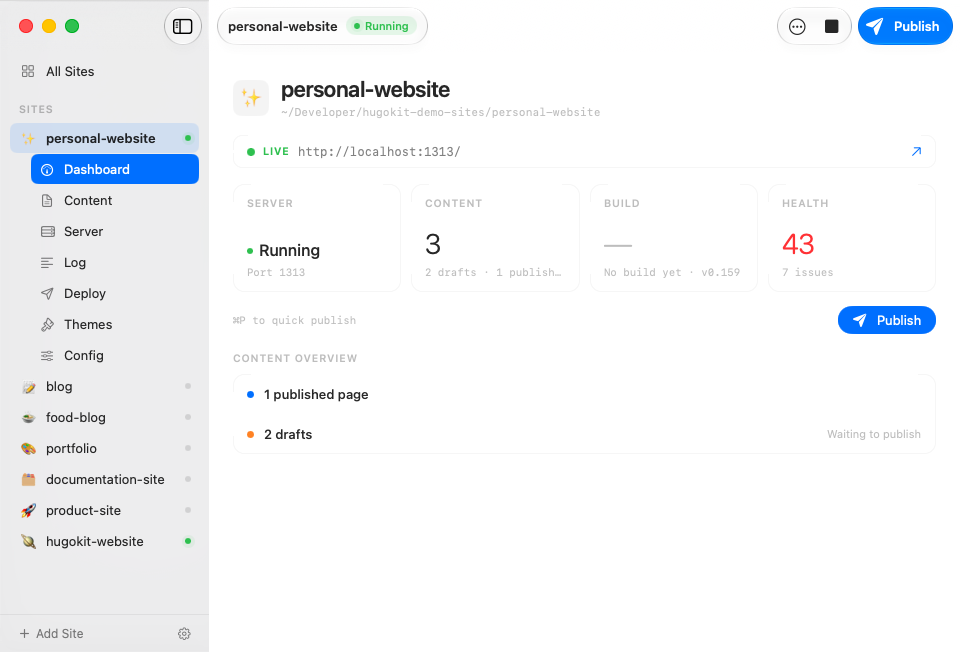

# HugoKit

A Mac app for [Hugo](https://gohugo.io). Run the server, preview your pages and publish your site from one window.

[Download](https://github.com/andersmortensen/hugokit/releases/latest) · [hugokit.com](https://hugokit.com) · [Report a bug](https://github.com/andersmortensen/hugokit/issues)

## What it does

Hugo is fast, but it lives in the terminal. HugoKit puts the parts you use every day — the server, the config, the content, the deploy — in a single native window.

- **Sites in one place.** A sidebar with every Hugo site you own, and an All Sites overview with grid and table views.
- **Server without the terminal.** Start, stop and restart `hugo server`, with port allocation and detection of servers you started yourself.
- **Readable logs.** Hugo's output is parsed into structured events instead of a wall of text.
- **Config editor.** Edit `hugo.toml` in a form or as raw text, with diagnostics that explain what's wrong before you save.
- **Content browser.** Browse and filter your content, create new pages from your own archetypes, and preview templates.
- **Theme gallery.** Browse community themes, preview them, and install with one click — or scaffold a theme of your own.
- **Publish.** Deploy to GitHub Pages (via GitHub Actions) or to any host over SFTP/FTP. Preflight checks catch the usual publish-blockers first.
- **Site health.** Front matter checks, content stats and build history per site.
- **Hugo reference.** The documentation you keep looking up, in a window next to your site.
- **Menu bar.** Server status and quick actions without opening the app.

## Install

1. Download the latest DMG from [Releases](https://github.com/andersmortensen/hugokit/releases/latest).
2. Open it and drag HugoKit to Applications.
3. Launch it. Onboarding finds (or installs) Hugo and helps you add your first site.

The app is signed with a Developer ID and notarized by Apple, and updates itself via Sparkle (**HugoKit → Check for Updates…**).

### Requirements

- macOS 26 (Tahoe) or later
- Hugo — HugoKit installs it for you if you don't have it

## Your files

HugoKit reads a standard Hugo project — `content/`, `themes/`, `hugo.toml` — and never restructures it. The one file it writes is `.hugokit/ftp-manifest.json`, a sync manifest so SFTP/FTP deploys upload only what actually changed. Nothing else in your site changes unless you ask for it.

Site references and settings live in `UserDefaults`. Credentials (GitHub tokens, SFTP passwords) live in the macOS Keychain, never in a config file.

## This repository

HugoKit is closed source. This repo carries the releases, the issue tracker and this README. Bug reports and feature requests are welcome — [open an issue](https://github.com/andersmortensen/hugokit/issues).

For anything else: [kontakt@andersmortensen.com](mailto:kontakt@andersmortensen.com)

## License

Proprietary. © 2026 Anders Mortensen. All rights reserved. The EULA ships with the app in the DMG.
